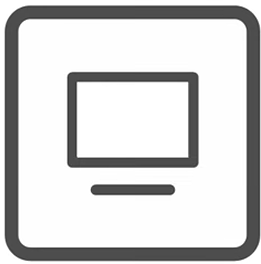
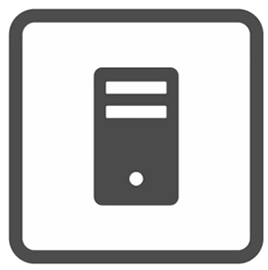

# Network Devices

Day 1 of CCNA 200-301 course by Jeremy's IT Lab. [Link](https://youtu.be/H8W9oMNSuwo?si=H0rFk7SUNY8nQwH8)

# Computer Network

## What is a computer network?

A network is a system where connected nodes can share resources with eachother

## What is a node?

Nodes here means network devices. They can be:

- Client
- Server
- Router
- Switch
- Firewall

## How do we build one?

The smallest network can be created with 2 devices connected with a cable

# Client

## What is a client?

A client is a device that uses services from a server

## What can act as a client?

Any device we use, for example: Laptop, Computer, Phone

# Server

## What is a server?

A server is a device that provides services for clients

## What can act as a server?

Client devices, Dedicated Servers

# Firewall

## What are the types of firewalls?

- Software firewall, which is installed directly onto laptop
- Hardware firewall, which is installed onto a dedicated network device
