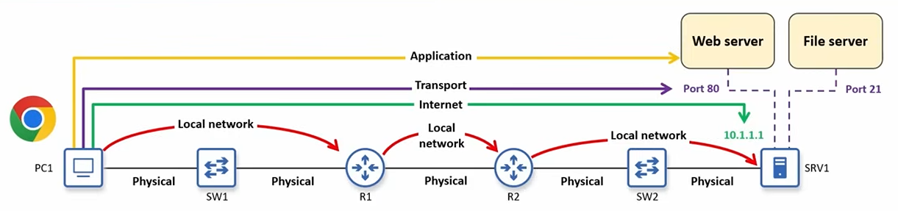

# TCP/IP Model

Day 3 of CCNA 200-301 by Jeremy's IT Lab.

## Protocols and Standards

| Category      | Definition                                                                                   | Examples                                   |
| ------------- | -------------------------------------------------------------------------------------------- | ------------------------------------------ |
| **Protocols** | Rules used by network devices to communicate data with each other.                           | TCP, IP, HTTP                              |
| **Standards** | Established specifications that describe how protocols and network technologies should work. | IEEE 802.11 (Wi-Fi), IEEE 802.3 (Ethernet) |

## TCP/IP Model

| Layer                                | Main Function                                                                                                                              | Addressing / Devices                                                       | Protocols / Examples                                                                |
| ------------------------------------ | ------------------------------------------------------------------------------------------------------------------------------------------ | -------------------------------------------------------------------------- | ----------------------------------------------------------------------------------- |
| **Application Layer** (Layer 5 or 7) | Provides communication between application processes. Responsible for formatting, sending, and interpreting application data.              | Applications                                                               | **Web:** HTTP, HTTPS **File Transfer:** FTP, SFTP **Email:** SMTP, POP3, IMAP |
| **Transport Layer** (Layer 4)        | Provides end-to-end communication between applications.                                                                                    | **Port numbers**; runs on communicating hosts such as clients and servers. | TCP (Transmission Control Protocol), UDP (User Datagram Protocol)                   |
| **Internet Layer** (Layer 3)         | Provides end-to-end delivery between hosts across different networks.                                                                      | **IP addresses**; routers operate at this layer.                           | IP (IPv4, IPv6), ICMP (Internet Control Message Protocol)                           |
| **Local Network Layer** (Layer 2)    | Provides hop-to-hop delivery within a local network. A **hop** is one step from a host/router to the next host/router in the path.         | **MAC addresses**; switches operate primarily at this layer.               | Ethernet (IEEE 802.3), Wi-Fi (IEEE 802.11)                                          |
| **Physical Layer** (Layer 1)         | Sends bits as electrical, optical, or radio signals through a physical medium. Defines cables, connectors, signal levels, and link speeds. | Physical transmission media and hardware                                   | Copper UTP cables, fiber-optic cables, Wi-Fi radio and antennas, netw               |

### Application Layer

- Protocols for communicating between application processes
- Responsible for format, send, and interpret data
- Used for browsing web pages: HTTP, HTTPS
- File transfer: FTP, SFTP
- Email: SMTP, POP3, IMAP

### Transport Layer

- Provides end-to-end communication between applications using port numbers
- Runs on communicating hosts (client and server)
- Protocols: UDP (User Datagram Protocol) and TCP (Transmission Control Protocol)

### Internet Layer

- Provides end-to-end delivery between hosts across networks using IP addresses and router
- Routers operate on this level
- Protocols: IP (IPv4, IPv6), ICMP (Internet Control Message Protocol)

### Local Network Layer

- Provides hop-to-hop delivery in a local network using MAC (Media Access Control) addresses and switches
- A hop is a step from one router or host to next router or host in the path
- Protocols: Ethernet (IEEE 802.3) and Wi-Fi (IEEE 802.11)

### Physical Layer

- Sends data (bits) as electrical, optical, or radio signals through physical medium
- Includes: cables, connectors, signal levels, and link speeds
- Example: copper UTP cables, fiber-optic cables, Wi-Fi radio and antennas, network interface cards
