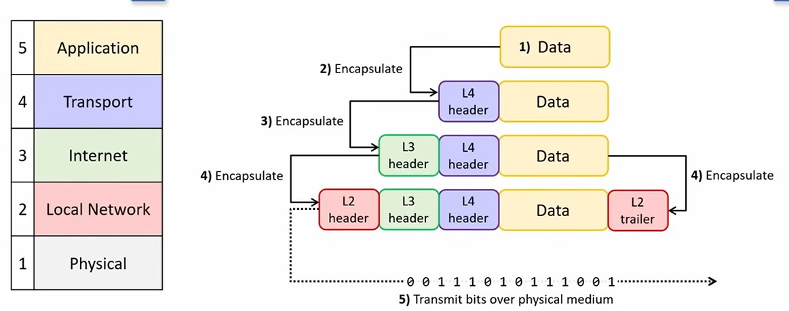
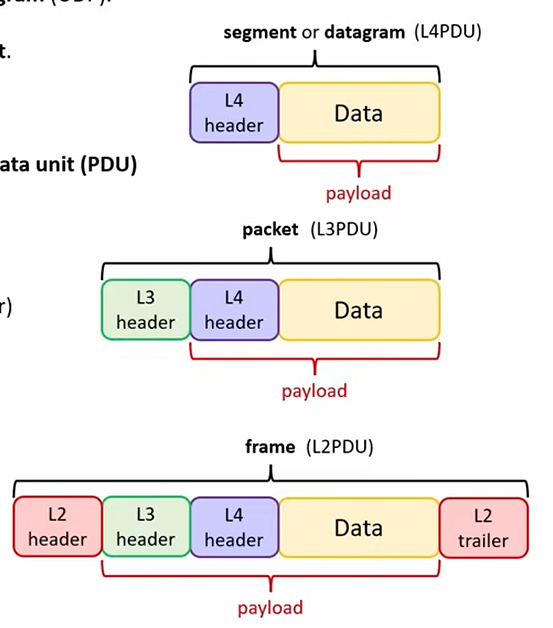

# TCP/IP Model

Day 3 of CCNA 200-301 by Jeremy's IT Lab.

## Protocols and Standards

| Category      | Definition                                                                                   | Examples                                   |
| ------------- | -------------------------------------------------------------------------------------------- | ------------------------------------------ |
| **Protocols** | Rules used by network devices to communicate data with each other.                           | TCP, IP, HTTP                              |
| **Standards** | Established specifications that describe how protocols and network technologies should work. | IEEE 802.11 (Wi-Fi), IEEE 802.3 (Ethernet) |

## TCP/IP Model

| Layer                                | Main Function                                                                                                                              | Addressing / Devices                                                       | Protocols / Examples                                                                |
| ------------------------------------ | ------------------------------------------------------------------------------------------------------------------------------------------ | -------------------------------------------------------------------------- | ----------------------------------------------------------------------------------- |
| **Application Layer** (Layer 5 or 7) | Provides communication between application processes. Responsible for formatting, sending, and interpreting application data.              | Applications                                                               | **Web:** HTTP, HTTPS **File Transfer:** FTP, SFTP **Email:** SMTP, POP3, IMAP |
| **Transport Layer** (Layer 4)        | Provides end-to-end communication between applications.                                                                                    | **Port numbers**; runs on communicating hosts such as clients and servers. | TCP (Transmission Control Protocol), UDP (User Datagram Protocol)                   |
| **Internet Layer** (Layer 3)         | Provides end-to-end delivery between hosts across different networks.                                                                      | **IP addresses**; routers operate at this layer.                           | IP (IPv4, IPv6), ICMP (Internet Control Message Protocol)                           |
| **Local Network Layer** (Layer 2)    | Provides hop-to-hop delivery within a local network. A **hop** is one step from a host/router to the next host/router in the path.         | **MAC addresses**; switches operate primarily at this layer.               | Ethernet (IEEE 802.3), Wi-Fi (IEEE 802.11)                                          |
| **Physical Layer** (Layer 1)         | Sends bits as electrical, optical, or radio signals through a physical medium. Defines cables, connectors, signal levels, and link speeds. | Physical transmission media and hardware                                   | Copper UTP cables, fiber-optic cables, Wi-Fi radio and antennas, netw               |

### Application Layer

- Protocols for communicating between application processes
- Responsible for format, send, and interpret data
- Used for browsing web pages: HTTP, HTTPS
- File transfer: FTP, SFTP
- Email: SMTP, POP3, IMAP

### Transport Layer

- Provides end-to-end communication between applications using port numbers
- Runs on communicating hosts (client and server)
- Protocols: UDP (User Datagram Protocol) and TCP (Transmission Control Protocol)

### Internet Layer

- Provides end-to-end delivery between hosts across networks using IP addresses and router
- Routers operate on this level
- Protocols: IP (IPv4, IPv6), ICMP (Internet Control Message Protocol)

### Local Network Layer

- Provides hop-to-hop delivery in a local network using MAC (Media Access Control) addresses and switches
- A hop is a step from one router or host to next router or host in the path
- Protocols: Ethernet (IEEE 802.3) and Wi-Fi (IEEE 802.11)

### Physical Layer

- Sends data (bits) as electrical, optical, or radio signals through physical medium
- Includes: cables, connectors, signal levels, and link speeds
- Example: copper UTP cables, fiber-optic cables, Wi-Fi radio and antennas, network interface cards

## Encapsulation and Decapsulation

### Encapsulation

#### What is it?

Encapsulation is a process where data gets wrapped by a header when it is passed on to the next layer. The header contains information needed by the layer, usually source and destination addresses (port numbers, IP addresses, MAC addresses).

#### How does it work?

- The application layer prepares data to be sent to the next layer.
- For each next layer, a header is added to the stack, encapsulating the data.
- Layer 2 (Network) adds a trailer that is used to check for data integrity
- Physical layer sends these bits as signals over the physical medium going left to right

### Decapsulation

#### What is it?

It is the process of going up the model's layers, examining the information contained in the headers, then removing them.

#### How does it work?

- Encapsulated data is sent through physical medium as bits on to the receiving end and given up the layer
- The header corresponding to the layer is examined, then removed, then passed on up the layers; layer 2 examines and removes L2 header and trailer, layer 3 examines and removes L3 header, layer 4 examines and removes L4 header, then only data is left to be sent to the application layer
- Data is then processed by the application layer

## Protocol Data Units (PDU)

### What does that even mean?

On each layer of the TCP/IP model, the data prepared has its own name.

- Combination of L4 header and application data is called a segment (TCP) or datagram (UDP). Also known as Layer 4 PDU (L4PDU)
- Combination of a segment/datagram and a L3 Header is called a packet. Also known as Layer 3 PDU (L3PDU)
- Combination of a packet and a L2 Header/trailer is called a frame. Also known as Layer 2 PDU (L2PDU)

The contents of PDU layer is called a payload.

- Payload of segment/datagram is application data
- Payload of packet is a segment/datagram
- Payload of frame is a packet

## Layers on the TCP/IP Model

### Adjacent-Layer Interaction

#### What does it mean?

Each layer on the model provides a service to the layer above it and is servied by the layer below it.

#### Explain it to me

- Layer 4 provides a service to Layer 5 by delivering data to the correct application using port numbers
- Layer 3 provides a service to Layer 4 by delivering segment/datagram to the correct destination host using IP address
- Layer 2 provides a service to Layer 3 by delivering the packet to the next hop using MAC address
- Layer 1 provides a service to Layer 2 by sending and receiving frames as electrical, optical, or radio signals

### Same-Layer Interaction

#### What is it?

Each layer communicates with the same layer on other devices

#### Explain it to me

- Application layer sends data to the Application layer of the other host
- A segment/datagram is addressed to Layer 4 port number of the correct application on the destination host
- A packet is addressed to Layer 3 IP Address of the destination host
- A frame is addressed to Layer 2 MAC address of the next hop
- Signals sent out of the physical port is received by the physical port on the other device

### Separation of Layers

#### What does it mean?

Each layer on the model has its own job and provides service to the layer above. This means layers are modular.

#### What is the main benefit of this model?

We can improve or replace protocols on layers without affecting other layers as long as it keeps its "contract". 